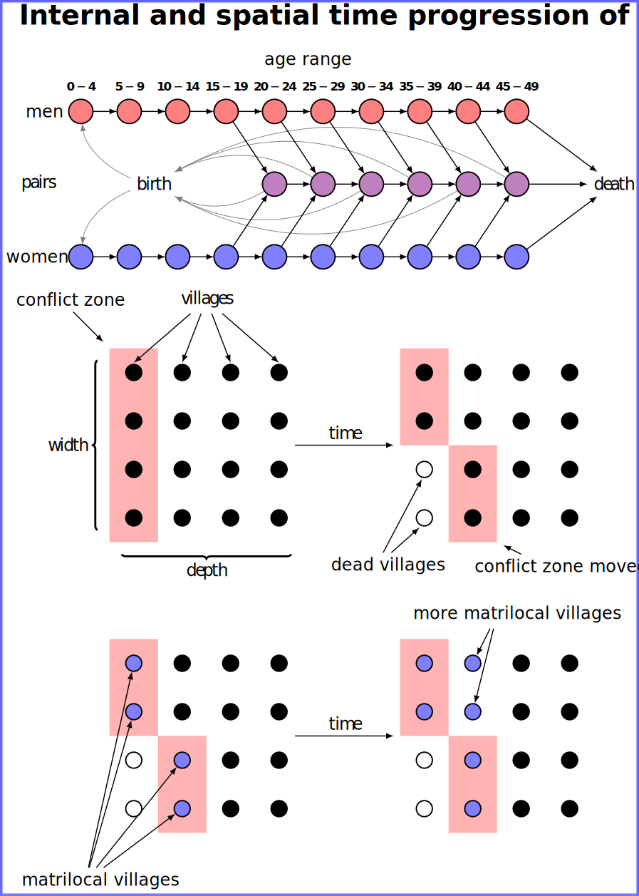

## Visualizing the design of an agent based model

* Tool: LaTeX with TikZ
* Challenge: How to visualize the structure and the design intention behind ABM?

#### Background
Agent-based models are characterized by an internal state of their agents, interaction with other agents, and interaction with an environment, so this one was rather simple. For simplicity, instead of modeling people directly, the simulated agents were villages who exchanged population, which was divided into age, sex and marriage status based cohorts. Given that the villages are not moving, the time-progression using a technique called small multiples was used to describe an intended outcome of the model, and thus design intention behind it, without having to display the animation.

The visualization was created in LaTeX and its TikZ library, which allows for complex programmatic definition. The cohorts and grid is created using a for cycle, which further decreased the amount of manual work required.

The model itself was written in Java using the Repast Simphony framework.
