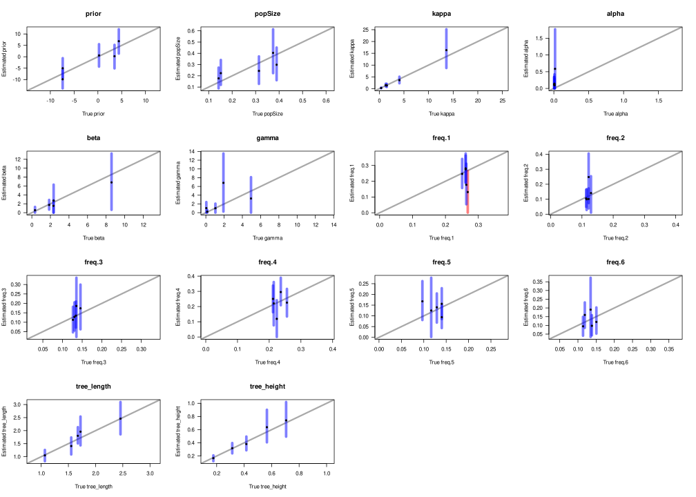

## Model validation diagnostics

* Tools: R
* Challenge: How to summarize model validation?

#### Background:

Developing model is a hard work. Not because implementing them is hard, but a proper validation requires simulating data from the model, and then checking the performance of the model on simulated data.

In the phylogenetic software BEAST, this is known as a *well-calibrated study* and should be part of any new model/package. However, BEAST doesn't really have any tools to do so easily, and every author needs to spend a considerable time replicating the same analysis, parsing XMLs, MCMC traces, and comparing them to the simulated data.

I have encountered the same problems when I was building a phylogenetic model for methylation data. That work did not pan out because we weren't able to get combined single-cell DNA and methylation data for our model, but I wrote a series of scripts to parse XML and generate input files for BEAST. Later, this evolved into the [beter](https://biods.github.io/beter/) package.

#### Challenge:

When performing *well-calibrated study*, data -- sequences -- are simulated from the model using some value of parameters, and then the parameters of the model are estimated from the data using the same model. This ensures that the model is well defined, implemented, and that at least it successfully estimate the correct values.

After a lot of thinking, I went for a minimalist design. Each estimate is represented with a mean and a 95% confidence interval. These are displayed as a point with associated bar. If the confidence interval includes the simulated value, it is displayed with a blue colour, and red otherwise. Appropriate alpha value of the colours help when plotting a large number of estimates.

This simple visualization, while not targeted at common audience and thus not eye candy, displays a vast amount of important information that can be determined from just a glance by an informed user. The size of bar tells user about the uncertainty of estimates, the position of mean communicates bias, apparent clustering then how well are parameters simulated in the first place. And colour-blind friendly colour coding give an idea about how successful the model is.

