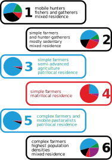

## Clustering of Ethnographic Atlas

* Tool: R + Inkscape
* Challenge: How to visually describe types of societies?
* Notes: Colour scheme already introduced

#### Background:

For my PhD, I was researching association between societies and their post-marital residence, that is, the residence that pairs lives in after they marry, the predominant one being the husbands family, i.e., the patrilocal residence. In literature, there are some traditional associations with agriculture, but many exception exists. My research goal was to find similar societies using unsupervised learning, and then look at the association of these clusters with residence. Essentially looking at different modes or types of societies and then examining their post-marital residence.

#### Challenge:
The final clustering produced 6 clusters (see [here](./ward.D_6.pdf)). The associated visualization described everything on the image, yet it was still missing something, what are those societies? What characterize them? How do they differ? Given that these clusters are constructed from ethnographic atlas, which contains a large number of descriptors characterizing every society, it is impossible to portray all of them. Thus came a creative part, where I was trying to find what determines these clusters (see [here](./k6/)). After exploring a few of them, I was able to provide simple, yet meaningful interpretation of the clustering, and thus 6 different types of societies and their associated post-marital residence patterns.
