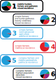

# Data visualization

This document contains my data visualizations and related challenges that led to them.

## Clustering societies in Ethnographic Atlas

* Tool: R + Inkscape
* Challenge: How to visually describe types of societies?
* Notes: Colour scheme already introduced

