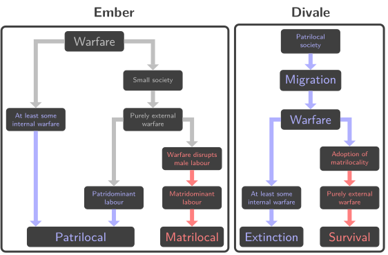

# Data visualization

This repository contains my data visualizations and related challenges that led to them.

## Clustering societies in Ethnographic Atlas

* Tools: R + Inkscape
* Challenge: How to visually describe types of societies?
* Notes: Colour scheme already introduced
* Details: [here](./EthnographicAtlas/)

## Visualizing the design of an agent based model

* Tool: LaTeX with TikZ
* Challenge: How to visualize the structure and the design intention behind ABM?
* Details: [here](./ABM/)

## Comparing anthropological theories

* Tools: LaTeX with TikZ
* Challenge: How to visually compare two theories?
* Details: [here](./PMR/)

